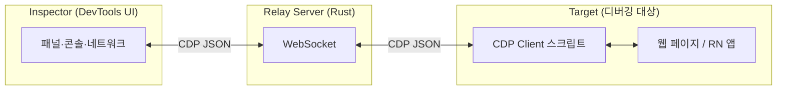

import { FolderTree } from '../../../src/components';

# 3-1. 배민 구현 따라하기

**배민 테크 블로그에서 따라 할 만한 부분**: "배민 구현 따라하기"는 웹 브라우저의 Console·DOM·DevTools를 자동으로 기록·재생하는 기능을, 개발자가 직접 흉내 내보는 시리즈로 보입니다. CRD에서도 유사한 목적의 기능을 하나 떼어내어, "배민 구현 따라하기"라는 제목으로 작성해 보기로 했습니다. 이번 파트에서는 **Replay** 패널을 자동으로 열고 검색어를 입력하는 기능을 예로 들어 설명합니다.

## 사실 콘솔, 네트워크 등 구현

콘솔과 네트워크는 구현하기 너무 쉬웠다.
레퍼런스로 가져온 2개의 프로젝트에 이미 구현이 되어있었고, 과거에 조금은 만져본 크롬데브툴 프론트엔드였기 때문이다.
대부분 구현 안해 본 경우, 잘 모르는 경우 AI한테 질문과 검증 과정이 필요하고, 설계에 대한 명확한 비전이 없기 때문에 어찌저찌 실행은 되긴 하나 잘못 된 방향으로 설계했거나, 필요없는 코드들이 많이 들어간다던가, 최악의 경우 구현에 실패하는 경우가 있는데, 이러한 부분은 내가 잘 알고 있기 때문이였다.
디테일한 부분은 잘 몰랐지만, 레퍼런스 코드를 참고하게 하면 이러한 디테일한 부분은 AI가 잘 챙겨주었다.

그래서 AI에게 단순하게 노가다를 바로 시킬 수 있었고, 빠른 시간안에 해결이 되었다.

## 배민 기술 블로그의 '따라하기' 비전

배민은 CDP를 활용해 커스텀 CDP를 추가해 RR Replay를 크롬 데브툴 프론트엔드에 넣었다.

> **"기록방 URL로 당시 콘솔·네트워크·DOM 상태를 다시 볼 수 있습니다"**  

## CRD에서 따라 할 만한 기능: RR Web 커스텀 패널

카카오가 말했던 것엔 없었던 기능 중 하나다. 사용자 액션이 Sentry Replay처럼 재생되는 게 특징이고 오픈소스로 나와 있다. 2024년부터 업데이트는 거의 없고 2.0.0이 알파로만 나와 있지만, 쓰기엔 문제 없어 보였다.

## 구현하면서 생긴 질문들

패널은 어떻게 추가하는지? 크롬 리모트 데브툴에는 정의되지 않은 추가적인 통신 방법이 필요한데, 이건 어떻게 하는지?

시대가 급변하면서, 이러한 질문들을 해결해 줄 선생님이 있다.
말투는 친절하지만, 질문을 잘 해야만 원하는 답을 얻을 수 있는 우리 AI 선생님.

AI는 포크 따온 [chrome-remote-devtools](https://github.com/ohah/chrome-remote-devtools) 레포 구조를 보여 주면 된다. 서브모듈·폴더 구조는 대략 아래와 같다.

<FolderTree
  rootName="chrome-remote-devtools"
  items={[
    {
      name: 'crates',
      type: 'folder',
      comment: '# Rust 릴레이 서버',
      children: [
        {
          name: 'server',
          type: 'folder',
          children: [
            { name: 'src', type: 'folder', children: [] },
            { name: 'Cargo.toml', type: 'file' },
          ],
        },
      ],
    },
    {
      name: 'devtools',
      type: 'folder',
      comment: '# DevTools UI (서브모듈)',
      children: [
        {
          name: 'devtools-frontend',
          type: 'folder',
          comment: 'git submodule',
          children: [
            { name: 'front_end', type: 'folder', children: [] },
            { name: 'scripts', type: 'folder', children: [] },
          ],
        },
      ],
    },
    {
      name: 'packages',
      type: 'folder',
      comment: '# CDP 클라이언트·Inspector·RN 플러그인',
      children: [
        { name: 'client', type: 'folder', comment: '@ohah/chrome-remote-devtools-client', children: [] },
        { name: 'inspector', type: 'folder', comment: '@ohah/chrome-remote-devtools-inspector', children: [] },
        { name: 'react-native-inspector', type: 'folder', comment: 'RN용 Console·Network·Redux 등', children: [] },
      ],
    },
    { name: 'document', type: 'folder', children: [] },
    { name: 'examples', type: 'folder', comment: '# 예제 (웹, RN 등)', children: [] },
    { name: 'scripts', type: 'folder', children: [] },
    { name: 'tests', type: 'folder', children: [] },
    { name: 'Cargo.toml', type: 'file', comment: '# Rust 워크스페이스' },
    { name: 'package.json', type: 'file', comment: '# Bun 워크스페이스' },
    { name: 'README.md', type: 'file' },
  ]}
/>

## CRD에 맞춰 바꾼 점

배민이 하던 것처럼 "패널 탭"에 추가하여 UX를 헤치지 않으려 했는데, ** Chrome Devtools Protocal(이하 CDP)가 필요했다.

크롬 데브툴 프론트엔드와 크롬 브라우저는 일반적으로 앱내의 별도 프로토콜을 사용하거나, 기존의 원격연결 상황(안드로이드, 의도적인 원격 디버깅 포트열기 등)에서는 웹소켓을 활용하는데, 이 때 데브툴과 통신을 받기 위한것이 CDP이다.   

CRD에서 CDP 메시지가 오가는 구조는 대략 아래와 같다.

Inspector에서 보내는 명령(예: `Runtime.evaluate`, `Page.navigate`)은 WebSocket으로 릴레이 서버를 거쳐 타깃의 CDP 클라이언트에 전달되고, 응답·이벤트는 같은 경로로 되돌아온다. "패널 열기"처럼 DevTools UI만의 동작은 CDP 표준에 없으니, Inspector 쪽에서 패널 DOM을 직접 제어하거나 전용 메시지를 정의해서 쓰게 된다.

## AI야 프로토콜 짜줘.

서브모듈로 가져온 크롬 데브툴 프론트엔드의 프로토콜을 짜주기 시작했다.

정말 세상 편해졌다. 예전엔 네이밍 고민부터 시작해서 엄청 오래 걸렸을 텐데 `딸깍`이라니.

그리고 추후에 어떻게 될 지 모르지만, 이러한 탭들은 플러그인 형태로 제공되면 좋을거 같다 생각하여 rrweb은 package 형태로 빼서 구성했다.

## 구성하기

기록된 액션에서 "패널 열기"만 떼어 내더라도, 지금 열린 패널을 쿼리하고, 원하는 패널이 없으면 열기 액션을 넣는 로직이 필요했다. 타이핑은 입력창이 있는 패널을 찾아 포커스하고, 글자를 하나씩 넣은 뒤, 리액션이 올 때까지 기다리는 식으로 돌렸다. 이렇게 하면 배민 "따라하기"처럼 **사용자가 직접 하는 것처럼** 재생할 수 있다.

구현하다 보면 CDP와 DevTools UI 사이 괴리, 액션 후 리액션 시간을 어떻게 알지, 사용자가 이미 패널을 열어 둔 경우 같은 고민이 계속 나온다. 다만 실패해도 크게 문제될 구조가 아니라서, 그냥 해 보면서 맞춰 나갈 수 있었다.

:::info 1줄 요약
배민 '따라하기'를 CRD에 맞춰 Replay를 그대로 구현해보았다. 네트워크, 콘솔 탭 등등
:::
