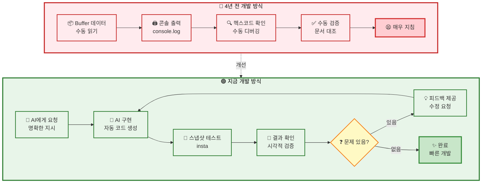

import { Badge } from '@theme';

# 3-2. 코어 개발하기

## 지루한 이야기

:::info 읽기 전 안내
이 문서는 HWP 스펙의 세부 내용보다는 **개발 과정과 문제 해결 방법**에 초점을 맞추고 있습니다.

:::

hwp 스펙에 다양한 부분을 알고 싶은게 아니라면, 
그냥 어떤 개발 과정으로 어떤 형태로 개발했냐가 궁금하다면 이 글을 봐도 괜찮을 것이다.

## 개발 시작하기 전 앞서 작성하는 AI 친화 주도 설계해보기

애당초 hwpjs가 hwp를 잘 제공하고 사람들에게 웹에서도 좋은 서비스를 제공하자는 목표가 아예 없는거는 아니지만, 동기 자체는 그냥 **러스트로 호들갑**이므로 모험적, 생각나는건 다 해보기로 했다.

최근 AI를 잘 활용하는 것도 개발자에게 필수 능력이 되었는데, 그 상황이 워낙 빠르게 변하고 새로운것이 우후죽순 나오는 것 같다.

원래도 개발업계, 특히 프론트엔드쪽은 눈만 떳다 하면 새로운 프레임워크 새로운 버전이 나와 적응이 힘들다고 생각헀는데, 
AI의 활용방법이나 새로운 AI에디터, AI 관련 프레임워크 등장 속도는 그것보다도 더 빠른것 같다.

다양한 방법과 다양한 툴 다양한 인공지능이 등장하고 있지만, 적어도 개발쪽에선 큰 맥락에서는 어떻게든 같아지고 있는것 같아서 다행인것 같긴 하다. 
일종의 수렴 진화라고 해야할까?

아직까지는, AI한테 잘 컨텍스트를 먹이고, 얼마나 잘게잘게 쪼개서 명확하게 명령을 내려서, 의도한 코딩만 잘 싹 해내게 하면서 최대한 개발자가 단순 코드 작성에 시간을 투자하지 않고,
설계나 코드 품질, 테스트코드, 문서화같은 큰 부분에 집중을 할 수 있게 하는 것이 가장 이상적인 활용 방법이 아닌가 생각했다.

발전 속도가 워낙 빨라서 AI를 또 어떻게 바뀔지 모르겠지만, 일단 개발자는 최대한 빠르게 적응하고 그에 맞는 퍼포먼스를 내야하는게 지금 상황에서 가장 중요한 것 같다.

### AI야 해줘
사실 인간이 가장 잘하는건 `해줘` 가 아닐까?
사람은 태어났을 때부터 `해줘`에 의지한다.  

태어나자마자 의사표현조차 명확히 하지 못해도 우는것으로 `해줘`
무한히 `해줘`의 인생을 살다가, 점점 성장하면서 `해줘` 하는 부분이 줄어들 뿐, 어떤 사람이든 `해줘` 라는 행동은 익숙하다 못해 전문가일것이다.

그런데 적당한 돈만 낸다면 헛소리도 하고 삽질도 하고 짜증은 나긴 하지만 일단 `해주는` 존재를 만났다.

어떻게 잘해주게 할까?

우선 rspress에 타인에게 공유 할 목적 + AI 에게 공유할 목적으로 docs를 만들었다.

바로 [HWP 파일 포맷](https://store.hancom.com/etc/hwpDownload.do)에서 공개한 한/글 문서 파일 형식 5.0의 공식 스펙 문서를 마크다운 형태로 옮기는 것.

그리고 agent.md(에이전트 가이드)에도 해당 부분을 참고하라고 적였다.
그리고 그렇게 적어놓은 docs에 적어놓은 [명세서](https://ohah.github.io/hwpjs/spec/index.html)이다.

사람도 보게 하고, AI도 보게 하고, 있어보이는 문서도 만들어서 별거 없지만 왠지 잘 만든것 같은 프로그램으로 어필도 하고 말이다.

:::info 1줄 요약
AI를 잘 고문하기 위해 세팅을 나름 힘들게 했다.
:::

## 핵심 파싱 구현 <Badge type="info">2025-11-23 ~ 2025-11-27</Badge>

HWPJS를 4년전에 하면서 hwp 포맷의 압축을 푸는법을 알고 있었기에, 이러한 압축 파일이과 포맷이니 u8 데이터 형태로 받고 해당 파일을 
`flate2`, `cfb`를 통해 빠르게 문서를 열어냈고, 과거처럼 BodyText, DocInfo 등을 바이너리 데이터에서 손쉽게 읽어냈고, 문서에서 제공하는 대로 버퍼데이터를 읽어야 하는 환경까지는 정말 손쉽게 접근할 수 있었다.

스펙 문서에도 적혀있지만, 간단히 설명하자면 한글 문서는 [Compound_File_Binary_Format](https://en.wikipedia.org/wiki/Compound_File_Binary_Format) 라는 포맷으로 만들어져있는데, 뭐 다른 이미지 포맷, 동영상 포맷처럼, CFB는 주로 문서를 위해 있는 규칙이라고 보면 된다.

이걸 읽어내고 풀어내기 위해선 CFB가 제공하는 문서에 따라 특정 바이트만큼은 무엇을 의미하는것이고, 특정 바이트는 어떤걸 의미하는 것 뭐 이걸 바이트 순서대로 읽어서 해석하면 되는것.

많이 쓰는 포맷이기에 이러한건 라이브러리도 잘 만들어져있어서 그냥 라이브러리 갖다 쓰면 된다.

그리고 한글의 경우는 이 CFB 포맷 안에 실질적인 내용은 압축이 되어있기에, 그렇게 읽어낸 CFB 파일을 한번 더 압축을 해제해야한다.

그렇기에 필요한게 `flate2` 라는 라이브러리이다.

사실 이러한 것도 생소했었던 4년전에는 CFB라는 단어도 처음 들어봤기에 이렇게 문서 포맷을 여는데만 해도 한 2일 걸렸던 것 같다.

:::info 1줄 요약
한글 문서는 이러쿵 저러쿵 포맷이 있는데 과거에 해본 경험이 있어서 빠르게 풀어서 본론으로 바로 들어갈 수 있었다.
:::

### DocInfo 파싱 <Badge type="tip">2025-11-23 ~ 2025-11-24</Badge>

- **DocumentProperties**: 문서 속성 정보
- **IdMappings**: ID 매핑 테이블
- **FaceName**: 글꼴 정보
- **BorderFill**: 테두리 및 채우기 정보
- **CharShape**: 문자 모양 정보
- **TabDef**: 탭 정의
- **Numbering**: 번호 매기기
- **Bullet**: 글머리표
- **Style**: 스타일 정보

### BodyText 파싱 <Badge type="tip">2025-11-24 ~ 2025-11-25</Badge>

문서 본문의 핵심 구조를 파싱했다.

- **BodyText 섹션 파싱**: CFB 경로를 통한 모듈화된 접근
- **ParaCharShape**: 문단별 문자 모양
- **ParaLineSeg**: 문단별 줄 분할 정보
- **ParaRangeTag**: 문단 범위 태그
- **CtrlHeader**: 컨트롤 헤더 파싱
- **ListHeader**: 목록 헤더 파싱

### 컨트롤 및 객체 파싱 <Badge type="warning">2025-11-25 ~ 2025-11-26</Badge>

다양한 컨트롤과 객체를 파싱했다.

- **PAGE_DEF**: 페이지 정의
- **FOOTNOTE_SHAPE**: 각주/미주 모양
- **PAGE_BORDER_FILL**: 페이지 테두리/채우기
- **SHAPE_COMPONENT**: 도형 컴포넌트 (선, 사각형, 타원, 다각형 등)
- **HWPTAG_TABLE**: 표 파싱
- **BinData**: 바이너리 데이터 (이미지 등)
- **PreviewText**: 미리보기 텍스트
- **PreviewImage**: 미리보기 이미지 (base64 인코딩)
- **Scripts**: 스크립트 스토리지
- **XMLTemplate**: XML 템플릿

간단하게 git 히스토리만 나열하면 이렇게 되는데, 개발 과정은 정말 단순하고 지루한 파트이다. 

AI와 함께 하기 전이라면 말이다. 하지만 여태까지는 다른 경험이였다.

간단히 설명하자면 앞으로 해야할 작업들은
압축을 푼 데이터는 버퍼형태(숫자 형태의 배열)로 되어있고, 특정 헤더값이 들어오면, 정해진 특정 바이트 크기가 있다. 
그리고 그 바이트 크기가 끝나면 다시 헤더가 오고 이런 형태로 문서가 반복되어있다.
그렇게 계속 문서에 맞게 데이터를 읽어서 파싱하면 되는것.

이렇게 파싱하는 것은 사실 문서에 정의된 대로 하면 되는 것이고, 특별히 어려운 부분은 없다.

다만 길고 지루한 노가다 작업일 뿐..

> 4년 전의 개발 방식

4년전만 해도, 데이터 헤더가 제대로 들어오는지, 헤더가 뭐냐, 헤더 앞에 뭐가 있냐, 데이터 레코드 앞에 뭐가 있냐, 데이터 레코드 뒤에 뭐가 있냐, 그리고 어디까지가 데이터가 무엇인지 Buffer 데이터 형태를 직접 콘솔로 찍으면서 확인하였었다. 

왜냐면 실제로 제대로 데이터를 읽고 그 데이터만큼 잘 이동했는지, 그 데이터가 문서에 설명하는 데이터가 맞는지 하나하나 체크해보지 않으면 실수, 또는 문서에서 잘못 설명한 부분으로 인해 데이터를 잘못 읽어내는 경우가 발생할 수 있고, 그렇게 발생하는 경우, 어디서부터 잘못 읽었는지 매우 찾기 힘들기 때문이다.

그러다가 아 사람들이 왜 헥스코드로 디버깅 하는지 몸으로 비로서 깨달았었던 때가 그 때이다.

숫자보단 헥스코드가 좀 더 짧아서 그나마 한눈에 들어올 수 있어서 그랬다는것을.

그래서 레거시 코드에 보면 디버깅을 위한 헥스코드 부분이 있다.

그때당시엔 일일이 문서와 일치하는지 문서별로 헤더를 가져올때 제대로 가져오는지 직접 다 콘솔을 찍어가면서 헤당 크기 뒤에 다시 헤더가 오는지 확인 하느라 바빴고 그거에 매우 지쳤었다.

:::tip 하지만 4년전과는 다른 나
러스트로 개발하고 싶어서 호들갑 상태, 그리고 `해줘`가 가능한 상태라는 것
:::

그렇기에 AI가 한 결과물을 쉽게 볼 수 있는 스냅샷(insta)를 활용해 AI가 동작 후 스냅샷을 따게 했고, 그 결과물을 보면서 AI가 잘못된 방향으로 코딩을 할 때마다 지적을 해가면서 개발했고, 그렇다보니 항상 이러한 데이터를 읽을 때 필수 불가결하게 해야했던 반복작업을 일임할 수 있었다.

:::info 1줄 요약
예전과는 다르게 힙스터한 방법과 설계를 통해 단순 반복작업보다는 좀 더 코드 품질에 대해 고민 할 수 있었다.
:::

:::details 나의 개발의 코드 작성을 80% 이상 대신 해주었던 AI와의 대화

> 표1번에 있는거 상수 선언해주고, 일단 다음 작업을 위해 하는거니까 다른건 진행하지말고 딱 이부분만 진행해

> "상수 선언한것 중 이 헤더는 이 표에 있으니까 이것만 구현해, 그리고 스냅샷으로 실행해"

> "좋아, 잘 나왔는데 이 부분은 문서가 잘못된거다. 레거시 코드를 참조하면 해당 부분이 있다."

> "그리고 레거시에선 이렇게 읽었었는데 이번엔 저렇게 읽으면 좋을것 같다."

> "왜 이렇게 개발했어? 난 이 방향이 더 좋은것 같은데 설명해봐"

> "그리고 잘못 하고 있는것 같은데 이 부분 raw_data로 출력해봐 내가 확인해볼게"

> "좋아 agent에 룰 추가해서 적어주고, 문서에도 추가해 이 부분은"

> "이 부분은 아까도 썼던 패턴인데 모듈화 하는게 좋지 않아?"

> "이 부분 좀 잘못 된거 같은데 예제 파일 추가했으니 비교해봐"

> "이 데이터 왜 이렇게 들어와? 로그 남겨줘"

> "일단 이 부분은 백로그로 남겨두고 다른것부터 하자"

> "너무 많은 라인인데, 폴더 구조 DOCS의 HEADER에 최대한 맞게 해서 파서별로 나누자"

:::

사실 개발하면서 테스트코드를 잘 안 쓰게 되는 개인적인 이유는 테스트 코드를 쓰는 시간에 그냥 개발했으면 진도가 더 나갔기 때문이였는데, AI 덕택에 테스트코드를 쓰는게 더 개발 속도가 더 빠르게 나가는 느낌이 생기기 시작했다.

단순한 노가다 타이핑은 AI가 정말 빠르게 잘 작성해주고, 그럼 이 코드가 맞는지 확인하는건 `println!`(자바스크립트의 콘솔과 비슷한 함수)로 하는것보다 스냅샷으로 눈으로 확인하고 진행하는 것이 정말 좋았다.

특히 러스트는 기본적으로 코드량이 길고, 문법이 항상 햇갈리기에, 나보다 더 빠르게 컴파일러 에러를 읽고 문법 에러를 읽어서 수정하는 형태로 가다보니, 실제 코드 작성하는 창보다 AI와 대화하는 창에서 코드 작성 명령을 내리는 일이 훨씬 많았다.

그리고 그게 훨씬 빠르다는걸 굳이 하지 않아도 느꼈다.

:::info 결론이니 3줄 요약
이걸 손으로 했다면 단순 타이핑양으로만 따져도 2-3달 걸렸을 일이다.  
그럤으면 지쳐서 코어만 개발하다 관뒀을꺼다.  
그리고 전과 다름 없는 코드 품질이였을꺼다.  
:::

## 그림 요약

