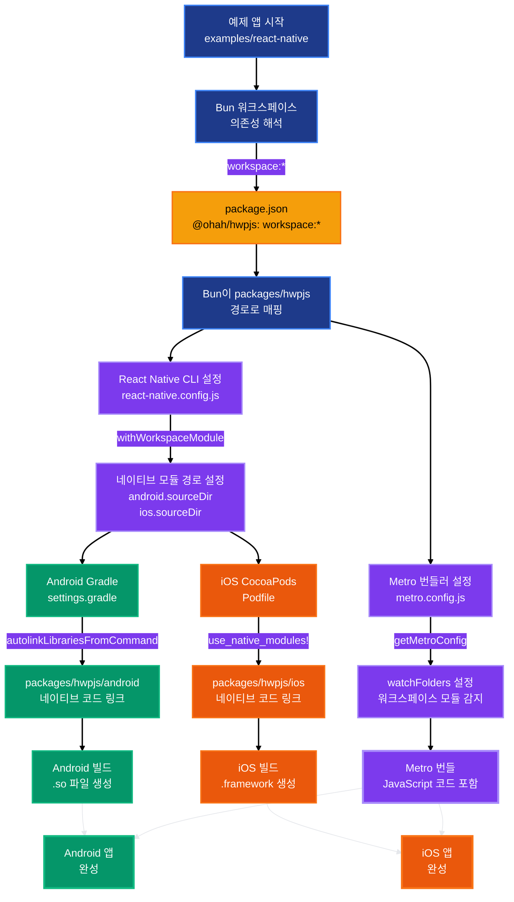

import { Badge } from '@theme';

# 3-4. 배포(Craby)

NAPI-RS로 Node.js 환경을 설정한 다음, 이제 React Native 환경을 설정해야 했다.  
목표는 React Native 앱에서도 러스트 코드를 실행하는 것이었고, 선택한 게 [Craby](https://craby.rs/)였다.

### 왜 Craby?

사실 Craby를 보고 이런 멀티 플랫폼 라이브러리 개발을 생각했다.  
Craby가 없었다면 아마 이 프로젝트를 시작하지 않았을 수도 있다.

Craby는 TurboModule을 통하여 러스트 코드를 C(cxx)를 통해 바인딩하고, 그걸 각각의 네이티브 영역에서 실행시킬 수 있게 해주는 React Native 라이브러리다.  
나온지 얼마 안됐고 정식 버전도 안나왔지만 대안이 없었다.

그래서 NAPI-RS 설정이 끝난 지 5일 만인 11월 27일, Craby 환경 설정을 시작했다.

### 초기 설정 과정

Craby는 NAPI-RS와는 다른 구조를 가지고 있다.  
NAPI-RS는 러스트 코드를 직접 바인딩하는 방식이지만, Craby는 TypeScript를 먼저 생성하고, 코드젠을 통해 러스트 코드와 바인딩에 필요한 C, iOS, Android 코드를 생성한다.

초기 커밋을 보면 `packages/hwpjs` 폴더에 Craby 프로젝트가 추가되었고, 다음과 같은 파일들이 생성되었다:

- `craby.toml`: Craby 설정 파일
- `android/`: Android 네이티브 코드
- `ios/`: iOS 네이티브 코드
- `cpp/`: C++ 바인딩 코드
- `crates/lib/`: 러스트 라이브러리 코드

### React Native 특성상의 복잡함

React Native는 Android와 iOS 두 플랫폼을 모두 지원해야 한다.  
그래서 각 플랫폼별로 네이티브 코드가 필요하다.

Android는 CMake와 Gradle을 사용하고, iOS는 Xcode 프로젝트가 필요하다.  
Craby가 이걸 자동으로 생성해주긴 하지만, 여전히 각 플랫폼의 빌드 환경이 필요했다.

Android는 Android SDK와 NDK가 필요하고, iOS는 Xcode가 필요하다.  
맥에서 개발하고 있었기 때문에 iOS는 문제없었지만, Android 설정은 또 삽질이었다.

### 첫 빌드

설정이 끝나고 첫 빌드를 시도했을 때, 생각보다 많은 설정이 필요했다.  
Android SDK 경로 설정, NDK 버전 맞추기, Gradle 설정 등등...

하지만 일단 빌드가 성공하고 나니, 러스트 코드를 React Native에서 호출할 수 있는 기본 틀은 완성되었다.

### 빌드 용량 문제

빌드가 성공하고 나니 또 다른 문제가 생겼다.  
패키지 크기가 **205MB**나 됐다.

React Native 앱에서 네이티브 모듈을 사용하려면 각 플랫폼별로 바이너리를 포함해야 하는데, 러스트로 빌드한 바이너리가 생각보다 컸다.  
특히 디버그 심볼과 최적화되지 않은 코드가 포함되어 있어서 용량이 불필요하게 커졌다.

그래서 러스트 빌드 최적화를 적용했다:

- **LTO (Link Time Optimization)**: `lto = "fat"`로 설정해서 링크 타임 최적화 적용
- **Strip 디버그 심볼**: `strip = true`로 설정해서 디버그 심볼 제거
- **크기 최적화**: `opt-level = "z"`로 설정해서 바이너리 크기를 최소화
- **Panic 처리**: `panic = "abort"`로 설정해서 패닉 핸들러 크기 감소

이렇게 최적화하니 패키지 크기가 **131MB**로 줄어들었다.  
약 36% 감소한 거지만, 여전히 크긴 했다.

하지만 더 줄이려면 기능을 제거하거나 다른 최적화를 해야 하는데, 그건 나중에 천천히 하기로 했다.  
사실 그렇게 용량이 큰 이유는 ios의 운영체제별, 시뮬레이터별로 빌드가 되어야하고, 안드로이드도 마찬가지로 시뮬레이터, 운영체제별로 빌드되어야해서 이므로 실제 빌드 될때는 20~30MB의 파일만 포함되지만, 순수 자바스크립트 번들에 비하면 너무 커보이는게 사실.  
최적화 방안이 딱히 떠오르지 않아서 여기서 일단 멈추기로 했다.
일단은 작동하는 게 우선이었고, 용량은 사용자가 실제로 사용해보면서 문제가 되면 그때 최적화하면 된다고 생각했다.

### 모노레포 Bun 환경에서의 예제 앱 커스텀 설정

hwpjs는 Bun 워크스페이스를 사용하는 모노레포 구조였다.  
그래서 예제 앱에서도 워크스페이스 내의 패키지를 사용할 수 있도록 여러 커스텀 설정이 필요했다.

#### React Native 예제 앱 설정

React Native 예제 앱은 `examples/react-native`에 있었는데, 여기서 `packages/hwpjs`를 사용해야 했다.

**1. Metro 번들러 설정**

Metro는 React Native의 번들러인데, 워크스페이스 모듈을 인식하도록 설정해야 했다.  
`metro.config.js`에서 `@craby/devkit`의 `getMetroConfig`를 사용했다:

```javascript
const { getMetroConfig } = require('@craby/devkit');
const { getDefaultConfig, mergeConfig } = require('@react-native/metro-config');

const config = getMetroConfig(__dirname);
module.exports = mergeConfig(getDefaultConfig(__dirname), config);
```

이렇게 하면 Craby가 생성한 네이티브 모듈을 Metro가 제대로 인식할 수 있었다.

**2. React Native CLI 설정**

`react-native.config.js`에서 `@craby/devkit`의 `withWorkspaceModule`을 사용해서 워크스페이스 모듈을 연결했다:

```javascript
const { withWorkspaceModule } = require('@craby/devkit');

const modulePackagePath = __dirname;
const config = {};

module.exports = withWorkspaceModule(config, modulePackagePath);
```

이렇게 하면 React Native CLI가 워크스페이스 내의 패키지를 찾을 수 있었다.

**3. 패키지 의존성 설정**

`package.json`에서 `workspace:*` 프로토콜을 사용해서 로컬 워크스페이스 패키지를 참조했다:

```json
{
  "dependencies": {
    "@ohah/hwpjs": "workspace:*"
  }
}
```

Bun이 이걸 자동으로 해석해서 워크스페이스 내의 `packages/hwpjs`를 연결해줬다.

**4. TypeScript 설정**

`tsconfig.json`에서 React Native의 기본 설정을 확장하면서 DOM 타입도 추가했다:

```json
{
  "extends": "@react-native/typescript-config",
  "compilerOptions": {
    "lib": ["ES2020", "DOM"]
  }
}
```

#### 커스텀 설정의 어려움

모노레포 환경에서 예제 앱을 만드는 건 생각보다 복잡했다.  
각 플랫폼마다 다른 번들러와 빌드 시스템을 사용하기 때문에, 워크스페이스 모듈을 연결하는 방법도 달라졌다.

특히 React Native는 Metro 번들러와 네이티브 빌드 시스템이 복잡하게 얽혀있어서, 워크스페이스 모듈을 제대로 연결하는 게 쉽지 않았다.  

#### 워크스페이스 모듈 연결 과정

React Native에서 워크스페이스 모듈을 연결하려면 여러 단계가 필요했다:

**1. JavaScript/TypeScript 레벨 연결 (Metro 번들러)**

먼저 Metro 번들러가 워크스페이스 모듈을 찾을 수 있도록 해야 했다.  
`metro.config.js`에서 `getMetroConfig`를 사용하면, Craby가 생성한 네이티브 모듈의 경로를 Metro에 알려준다:

```javascript
const { getMetroConfig } = require('@craby/devkit');
const { getDefaultConfig, mergeConfig } = require('@react-native/metro-config');

const config = getMetroConfig(__dirname);
module.exports = mergeConfig(getDefaultConfig(__dirname), config);
```

`getMetroConfig`는 내부적으로 `watchFolders`와 `resolver.sourceExts`를 설정해서 워크스페이스 모듈을 찾을 수 있게 해준다.

**2. React Native CLI 레벨 연결**

React Native CLI가 워크스페이스 모듈을 인식하도록 `react-native.config.js`를 설정해야 했다.  
실제로는 `@craby/devkit`의 `withWorkspaceModule` 함수를 사용했는데, 이 함수가 워크스페이스 모듈의 경로를 찾아서 React Native CLI에 알려준다:

```javascript
const { withWorkspaceModule } = require('@craby/devkit');

const modulePackagePath = __dirname;
const config = {};

module.exports = withWorkspaceModule(config, modulePackagePath);
```

이 함수는 내부적으로 `packages/hwpjs`의 경로를 찾아서 `project.android.sourceDir`와 `project.ios.sourceDir`를 설정한다.  
그래서 React Native CLI가 `packages/hwpjs/android`와 `packages/hwpjs/ios`를 네이티브 모듈로 인식할 수 있게 된다.

다만 `@craby/devkit`가 초기 버전이라 이 함수가 제대로 작동하지 않을 수도 있었다.  
그래서 실제로는 수동으로 경로를 설정하거나, 다른 방법으로 연결했을 수도 있다.

**3. Android 네이티브 빌드 연결**

Android는 Gradle을 사용하는데, `settings.gradle`에서 `autolinkLibrariesFromCommand`를 사용해서 자동으로 네이티브 모듈을 링크한다:

```groovy
pluginManagement { includeBuild("../node_modules/@react-native/gradle-plugin") }
plugins { id("com.facebook.react.settings") }
extensions.configure(com.facebook.react.ReactSettingsExtension){ ex -> 
  ex.autolinkLibrariesFromCommand() 
}
```

이 명령은 `react-native.config.js`를 읽어서 `@ohah/hwpjs` 패키지의 Android 네이티브 코드 경로를 찾고, Gradle 프로젝트에 포함시킨다.

실제로는 `packages/hwpjs/android` 디렉토리의 네이티브 코드가 빌드에 포함되고, 생성된 `.so` 파일이 앱 번들에 포함된다.

**4. iOS 네이티브 빌드 연결**

iOS는 CocoaPods를 사용하는데, `Podfile`에서 `use_native_modules!`를 호출하면 자동으로 네이티브 모듈을 링크한다:

```ruby
target 'ReactNativeExample' do
  config = use_native_modules!
  
  use_react_native!(
    :path => config[:reactNativePath],
    :app_path => "#{Pod::Config.instance.installation_root}/.."
  )
end
```

`use_native_modules!`는 `react-native.config.js`를 읽어서 `@ohah/hwpjs` 패키지의 iOS 네이티브 코드 경로를 찾고, Podfile에 추가한다.

실제로는 `packages/hwpjs/ios/ReactNative.podspec` 파일이 로드되고, 생성된 `.framework` 파일이 Xcode 프로젝트에 링크된다.

**5. Bun 워크스페이스 의존성 해석**

마지막으로 `package.json`에서 `workspace:*` 프로토콜을 사용하면, Bun이 워크스페이스 내의 패키지를 자동으로 찾아서 연결해준다:

```json
{
  "dependencies": {
    "@ohah/hwpjs": "workspace:*"
  }
}
```

Bun은 루트의 `package.json`에서 워크스페이스 설정을 읽고, `packages/hwpjs`를 `@ohah/hwpjs`로 매핑해준다.

#### 연결 과정의 복잡함

이렇게 여러 단계를 거쳐야 하는 이유는 React Native가 JavaScript 번들러(Metro), Android 빌드 시스템(Gradle), iOS 빌드 시스템(CocoaPods) 세 가지를 모두 사용하기 때문이다.

각각이 독립적으로 동작하기 때문에, 워크스페이스 모듈을 연결하려면:
1. Metro가 JavaScript 코드를 찾을 수 있어야 하고
2. Gradle이 Android 네이티브 코드를 찾을 수 있어야 하고  
3. CocoaPods가 iOS 네이티브 코드를 찾을 수 있어야 한다

Craby의 `@craby/devkit`가 이런 복잡한 설정을 자동화해주긴 했지만, 여전히 각 플랫폼의 빌드 시스템이 제대로 동작하도록 설정 파일들을 올바르게 작성해야 했다.

하지만 일단 설정이 끝나고 나니, 예제 앱에서 워크스페이스 내의 패키지를 자연스럽게 사용할 수 있게 됐다.

#### 캐시 문제의 지옥

이런 설정들을 수정할 때 가장 짜증나는 건 캐시 문제였다.  
Metro 번들러, Gradle, CocoaPods, Xcode 모두 각자 캐시를 가지고 있어서, 설정을 수정해도 이전 캐시가 남아있으면 제대로 반영이 안 되는 경우가 많았다.

특히 어설프게 꼬인 캐시들 때문에 실행이 돼다가 안되다가 하는 경우가 많았다.  
"해결됐다!" 하고 기뻐했는데, 캐시를 날리고 다시 빌드해보면 또 안 되는 경우도 꽤 있었다.

캐시를 날리고 빌드하고 테스트하는 건 상당한 시간이 소요되는 작업이라 엄청 귀찮았다:

- **Metro 캐시**: `npx react-native start --reset-cache` 또는 `rm -rf /tmp/metro-*`
- **Gradle 캐시**: `cd android && ./gradlew clean` 또는 `rm -rf .gradle build`
- **CocoaPods 캐시**: `cd ios && pod deintegrate && pod install` 또는 `rm -rf Pods Podfile.lock`
- **Xcode 캐시**: `rm -rf ~/Library/Developer/Xcode/DerivedData`
- **Bun 캐시**: `bun install --force`

이 모든 걸 다 날리고 다시 빌드하는 데만 몇 분씩 걸렸다.  
그래서 설정을 수정할 때마다 "이번엔 진짜 해결된 거 맞지?" 하면서 불안해졌다.

특히 React Native는 JavaScript 번들러와 네이티브 빌드 시스템이 복잡하게 얽혀있어서, 어느 부분의 캐시 문제인지 찾기도 어려웠다.  
Metro 캐시를 날렸는데도 안 되면 Gradle 캐시를 날려보고, 그것도 안 되면 CocoaPods 캐시를 날려보고...  
이런 식으로 하나씩 시도해봐야 했고, 그 과정을 할때마다 드는 기분이 볶음짜장면스럽다.

## 워크스페이스 모듈 연결 플로우차트



### Craby 초기 버전의 한계와 기여

Craby는 나온지 얼마 안된 초기 버전이라 정말 실행되고 가능성만 있지, 사실 안정성이나 일반적인 라이브러리에서 기대하는 수준의 완성도는 기대하기 힘들었다.
그래서 필요한 기능들을 직접 구현하고 Craby 레포지토리에 기여하게 됐다.

#### 이슈 #72: Rust 워크스페이스에서 빌드 실패

hwpjs는 Bun + Rust 워크스페이스를 사용하는 구조였다.  
하지만 Craby로 빌드할 때 워크스페이스 환경에서 `target` 디렉토리를 찾지 못해서 빌드가 실패했다.

에러 메시지를 보니 `/target/aarch64-linux-android/release/libhwpjs.a` 파일을 찾을 수 없다고 나왔다.  
워크스페이스를 사용하면 `target` 디렉토리가 루트에 생성되는데, Craby는 현재 패키지 디렉토리 안의 `target`을 찾으려고 했던 거다.

주된 관심사가 보통 단일웹이 아니다보니, 이것저것 귀찮은 환경 세팅이 많아진다.
대부분의 보일러플레이트는 모노레포 기준이 아닌 단일레포 기준이다 보니 더더욱 그렇다
특히 라이브러리를 사용하는 입장에선 문제 없지만 그걸 개발하는 경우 문제가 생긴다.

라이브러리의 경우, 실제 작동하는 코드, 그리고 그걸 테스트가 되어야하는 테스트 코드, 사용법을 기록한 문서 등이 필요한데 대부분 이걸 하나의 모노레포 구조로 묶기 때문이다.
모노레포 구조로 묶는 경우 단일레포에서 사용되었던 라이브러리들의 경로들이 상이하게 바뀌고 최적화를 위해 symlink 등이 사용되는데, 리엑트 네이티브나 일렉트론 같은 자바스크립트 생태계에 끼어있지만 자바스크립트 코드가 아닌 다른 언어들의 코드가 들어가있는 경우 더더욱 문제가 많이 발생한다.

아래도 그러한 이슈에서 발생한 것이였다.

특히 이러한 문제는 OS별로도 해결법 및 증상이 대부분 상이하기에 더더욱 복잡해진다.
브라우저에선 사파리가 악명이 높다면, OS쪽에서는 윈도우가 악명이 높다.

일단은 `packages/hwpjs/target` 심볼릭 링크를 만들어서 해결했지만, 이건 임시방편이었다.  
그래서 [이슈 #72](https://github.com/leegeunhyeok/craby/issues/72)를 올렸다.
다만 수정을 직접 하려했는데 해당 저장소의 메인테이너가 수정을 해주어서, 임시방편으로 해결하다가 업데이트 된 이후 해결되었다.

#### 이슈 #76: ArrayBuffer 타입 사용 시 앱 크래시

HWP 파일을 읽을 때 `ArrayBuffer`를 사용해야 했다.  
하지만 `ArrayBuffer`를 `rust::Vec<uint8_t>`로 변환할 때 앱이 크래시됐다.

문제는 생성된 C++ 코드의 `Bridging<rust::Vec<uint8_t>>::fromJs` 구현에서 `std::memcpy`를 사용해서 데이터를 복사하는 부분이었다.  
`crates/craby_codegen/src/generators/cxx_generator.rs`의 694번째 줄에서 문제가 발생했다.

일단 임시 해결책으로 `createVecFromSlice` 함수를 만들어서 러스트에서 사이즈와 메모리 관리를 담당하게 직접 제너레이터 함수를 수동으로 수정하여 패키패키지 마냥 사용했다:

```rust
#[cxx_name = "createVecFromSlice"]
fn create_vec_from_slice(data: &[u8]) -> Vec<u8> {
    data.to_vec()
}
```

하지만 이건 올바른 해결책이 아니었다.  
C++ 코드 생성 부분을 수정해야 했다.

그래서 [이슈 #76](https://github.com/leegeunhyeok/craby/issues/76)을 올리고, PR을 제출해서 수정했다.  
`std::memcpy` 대신 `rust::Slice`를 사용해서 안전하게 데이터를 복사하도록 변경했다.

추후 Craby 기여과정은 별도의 카테고리에서 자세히 다룰 예정이다.

#### 기여를 하면서 느낀 점

오픈소스에 기여하고, 반영되는건 늘 재밌다. 물론 귀찮고 짜증나지만, 그만큼 내 코드가 불특정한 다양한 사용자에게 검증 받는다는 생각을 하고, 그러한 환경에 배포될 수 있는 코드를 작성했다는 사실은 기분을 나쁘지 않게 하고, 계속 도전하게 만든다.

:::info 1줄 요약
Craby로 React Native 환경 설정을 했고, 필요한 기능들을 직접 구현해서 Craby 레포지토리에 기여했다.
:::
